# 🛡️ Despliegue de Firewall Perimetral con pfSense

Este manual, documenta el proceso técnico para la implementación de un firewall como psSense, desde la descarga y preparación de la imagen hasta la configuración de la arquitectura de red en VirtualBox

---

## 📑 Índice de Contenidos
* [🛠️ Especificaciones Técnicas](#️-especificaciones-técnicas)
* [📂 Fase 00: Arquitectura y Diseño de Red](#-fase-00-arquitectura-y-diseño-de-red)
* [📂 Fase 01: Obtención y Preparación de la Imagen](#-fase-01-obtención-y-preparación-de-la-imagen)
* [📂 Fase 02: Configuración de la Máquina Virtual](#-fase-02-configuración-de-la-máquina-virtual-virtualbox)
* [📂 Fase 03: Instalación del Sistema (pfSense CE)](#-fase-03-instalación-del-sistema-pfsense-ce)
* [📂 Fase 04: Finalización y Desmontaje de Medios](#-fase-04-finalización-y-desmontaje-de-medios)
* [📂 Fase 05: Configuración Operativa de Red (Consola)](#-fase-05-configuración-operativa-de-red-consola)
* [📂 Fase 06: Pruebas de Conectividad y Verificación](#-fase-06-pruebas-de-conectividad-y-verificación)
* [📂 Fase 07: Configuración Inicial del Sistema](#-fase-07-configuración-inicial-del-sistema-general-setup)
* [📂 Fase 08: Configuración Avanzada de Interfaces](#-fase-08-configuración-avanzada-de-interfaces)
* [📂 Fase 09: Bloqueo de Clientes y Reglas de Filtrado](#-fase-09-bloqueo-de-clientes-y-reglas-de-filtrado)
* [📂 Fase 10: Reglas de Filtrado y Comunicación entre Zonas](#-fase-10-reglas-de-filtrado-y-comunicación-entre-zonas)
* [🏆 Conclusión Final](#-conclusión-final)
* [🧠 Lecciones Aprendidas (Troubleshooting)](#-lecciones-aprendidas-troubleshooting)
* [🚀 Hoja de Ruta (Próximos Pasos)](#-hoja-de-ruta-próximos-pasos)

---

## 🛠️ Especificaciones Técnicas
Para asegurar que se puede replicar este laboratorio, se detallan las versiones y recursos que se han usado:
* **Hipervisor:** Oracle VirtualBox 7.x
* **Sistema Operativo:** pfSense Community Edition (v2.8.1+)
* **Arquitectura:** AMD64 (64-bit)
* **Recursos VM:** 4GB RAM | 1 vCPU | 30GB VDI (Dinámico)
* **Interfaces de Red:** WAN (NAT) | DMZ (Internal Network) |  LAN (Internal Network)

--- 

## 📂 Fase 00: Arquitectura y Diseño de Red
Antes de proceder con la implementación técnica, se define el esquema lógico de la infraestructura. El diseño se basa en una arquitectura de tres niveles (Tiered Architecture) para garantizar el aislamiento de servicios críticos.

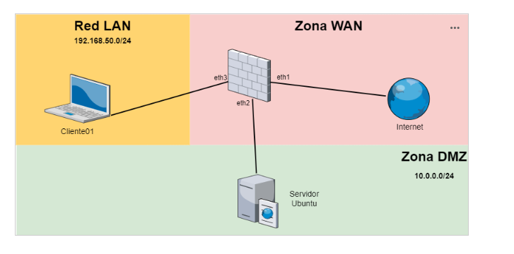

### Detalle de Segmentación:
* **Zona WAN (eth1):** Interfaz conectada al mundo exterior (NAT en VirtualBox) para salida a internet.
* **Zona DMZ (eth2 - 10.0.0.0/24):** Segmento destinado a servidores que ofrecen servicios externos, como el **Servidor Ubuntu**.
* **Red LAN (eth3 - 192.168.50.0/24):** Zona privada de alta confianza donde se ubica el **CLIENTE-LAN-1**.

---

## 📂 Fase 01: Obtención y Preparación de la Imagen
El proceso comienza con la adquisición de la imagen oficial, asegurando la integridad del software de seguridad perimetral a través de canales oficiales.

### Paso 1.1: Registro y Acceso al Portal
Se accede al portal oficial de **Netgate Store**. Aunque es una versión comunitaria, el flujo de trabajo requiere el registro del instalador para obtener los enlaces de descarga actualizados.

### Paso 1.2: Selección de la Arquitectura
Se configura el instalador seleccionando la arquitectura **AMD64 (64-bit)** y el tipo de instalador **DVD Image (ISO)**, garantizando la compatibilidad con el entorno de virtualización.

### Paso 1.3: Proceso de Checkout y Descarga
Se completa el proceso de obtención a coste cero ($0.00). Una vez validado el pedido, se habilita la descarga del paquete comprimido.

### Paso 1.4: Preparación del Medio (Descompresión)
El archivo descargado se presenta en formato comprimido `.iso.gz`. Es imperativo realizar la extracción mediante herramientas como 7-Zip para obtener la imagen `.iso` final.

---

## 📂 Fase 02: Configuración de la Máquina Virtual (VirtualBox)
En esta etapa se define el hardware virtual necesario para soportar un firewall de alto rendimiento. La correcta asignación de recursos y la segmentación de redes son los pilares de este laboratorio.

### Paso 2.1: Resumen de Configuración de la VM
Se ha creado una instancia optimizada con los siguientes parámetros técnicos, asegurando que el instalador de pfSense tenga acceso a todos los segmentos de red requeridos:

* **Sistema Operativo:** FreeBSD (64-bit).
* **Memoria RAM:** 4096 MB (Asignación generosa para asegurar fluidez en el procesado de paquetes).
* **Almacenamiento:** Disco VDI de 30 GB con la ISO oficial montada.
* **Segmentación de Red (Tiered Architecture):**
    * **Adaptador 1:** WAN (Configurado como NAT para salida a internet).
    * **Adaptador 2:** DMZ (Red interna para servicios expuestos).
    * **Adaptador 3:** LAN (Red interna aislada para clientes locales).

---

## 📂 Fase 03: Instalación del Sistema (pfSense CE)
En esta fase se realiza la configuración lógica de las interfaces y el particionado del disco duro virtual bajo el sistema de archivos ZFS.

### 3.1: Configuración de Interfaces
El instalador reconoce las tarjetas de red virtuales (em0, em1, em2). Se procede con la vinculación física-lógica.

### 3.2: Asignación WAN (em0)
Se designa la interfaz `em0` como WAN, configurada en modo DHCP para recibir conectividad del NAT de VirtualBox.

### 3.3: Asignación LAN (em2)
Siguiendo el diseño de red personalizado, se asigna la interfaz `em2` como LAN primaria.
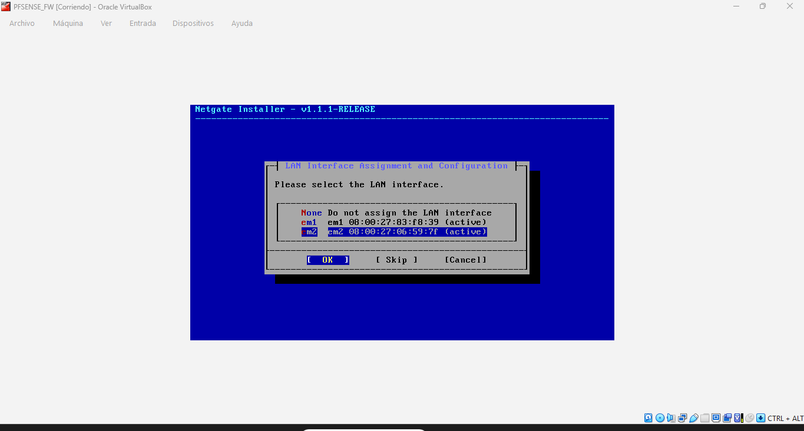

### 3.4: Selección de Versión y Sistema de Archivos
Se selecciona la versión **Community Edition (CE)** y el sistema de archivos **ZFS** con esquema de particiones **GPT**.

### 3.5: Particionado y Selección de Disco
Se configura un pool ZFS tipo **Stripe** (sin redundancia). 
> **Nota Crítica:** Es obligatorio marcar el disco `ada0` con la tecla **Espacio** hasta ver el asterisco `[*]`.

### 3.6: Ejecución y Reinicio
Confirmación final de escritura y proceso de instalación de paquetes.

--- 

## 📂 Fase 04: Finalización y Desmontaje de Medios
Fase crítica para romper el bucle de instalación y asegurar el arranque desde el disco duro virtual.

### 4.1: Desmontaje de la ISO en VirtualBox
Inmediatamente después de pulsar **Reboot**, se debe retirar la imagen ISO desde el menú del hipervisor para evitar que el instalador cargue nuevamente.
* **Ruta:** Dispositivos > Unidades Ópticas > Eliminar disco de la unidad virtual.

### 4.2: Primer Arranque del Kernel
Verificación de la secuencia de inicio de FreeBSD y carga de los servicios core de pfSense desde el pool ZFS.

--- 

## 📂 Fase 05: Configuración Operativa de Red (Consola)
En esta etapa final de consola, el firewall deja de tener una configuración estándar para adaptarse al esquema de red segmentado del laboratorio.

### 5.1: Acceso al Menú de Direccionamiento
Tras el primer arranque limpio, seleccionamos la **Opción 2 (Set interface(s) IP address)**. Este es el punto de entrada para definir manualmente las IPs de nuestra infraestructura.
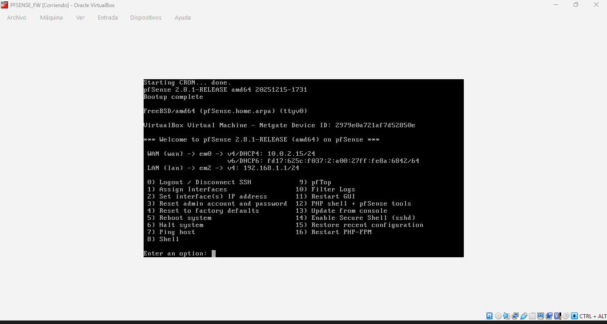

### 5.2: Configuración del Segmento LAN (192.168.50.1)
Se selecciona la interfaz **2 (LAN)**. Para garantizar el control total del segmento, se deniega la configuración por DHCP externo y se establece una IP estática.
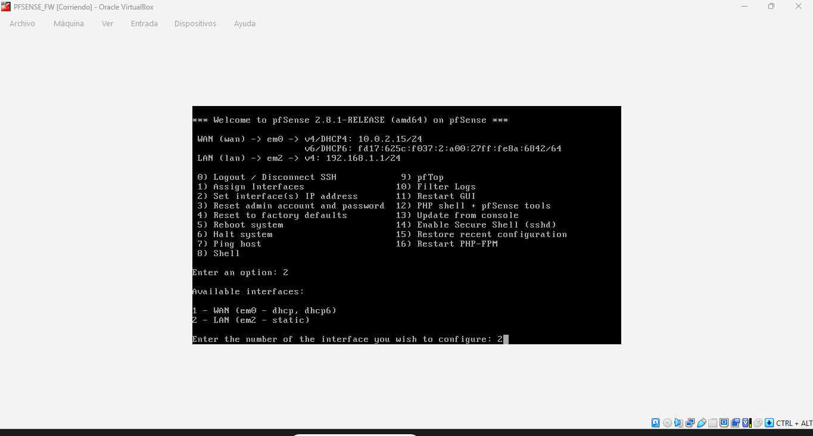

Se aplica la IP **192.168.50.1** con máscara **/24**. Adicionalmente, se activa el **Servidor DHCP interno** (rango .20 - .100) y se mantiene el protocolo **HTTPS** para la WebGUI por seguridad.
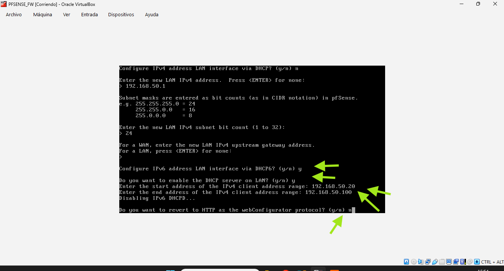
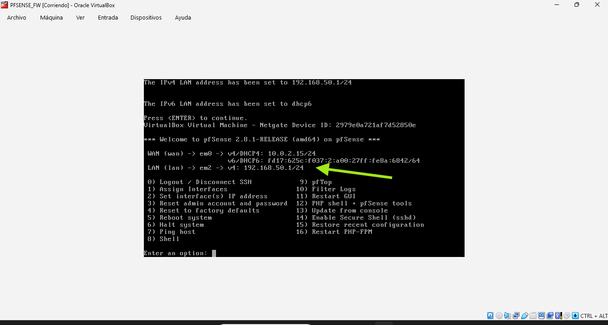

### 5.3: Asignación y Configuración de la DMZ (OPT1)
Para habilitar el tercer adaptador de red (em1), se utiliza la **Opción 1 (Assign Interfaces)**. Se realiza el mapeo lógico vinculando **em1** como la interfaz **Optional 1**.

Una vez asignada, se utiliza nuevamente la **Opción 2** para otorgar a la **DMZ** la dirección **10.0.0.1/24** y activar su propio servidor DHCP.

### 5.4: Estado Final de la Infraestructura
La configuración por consola concluye con éxito. El firewall presenta ahora sus tres zonas de red operativas y listas para la gestión mediante la interfaz web desde un cliente interno.

--- 

## 📂 Fase 06: Pruebas de Conectividad y Verificación
En esta fase se valida la correcta segmentación de la red y la operatividad de los servicios DHCP y Gateway desde los clientes finales, asegurando que el tráfico fluye según el diseño establecido.

### 6.1: Verificación de Direccionamiento IP (ipconfig)
Se inicia un cliente en la red LAN para comprobar que el servidor DHCP de pfSense ha asignado correctamente una dirección dentro del rango configurado (192.168.50.x). Se valida la puerta de enlace predeterminada.
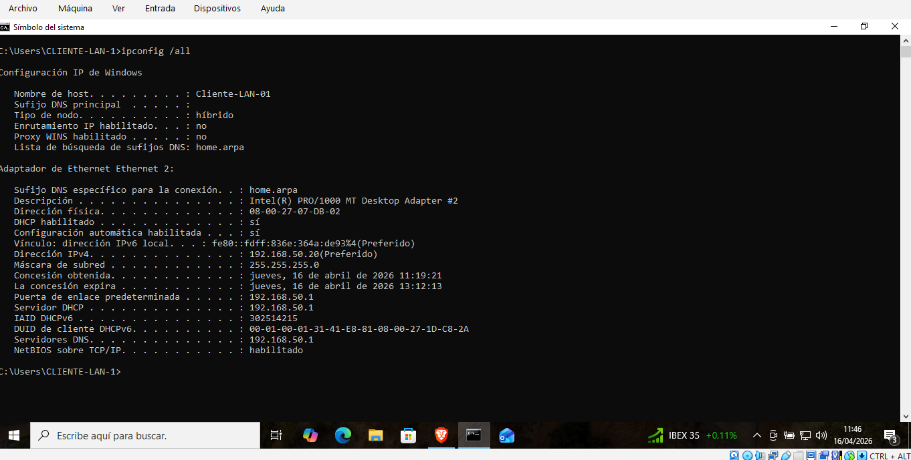

### 6.2: Prueba de Latencia a Gateway LAN
Se ejecuta un test de conectividad (`ping`) hacia la interfaz LAN del firewall (**192.168.50.1**). Esta prueba confirma que el enlace físico-lógico entre el cliente y el segmento de gestión es estable.
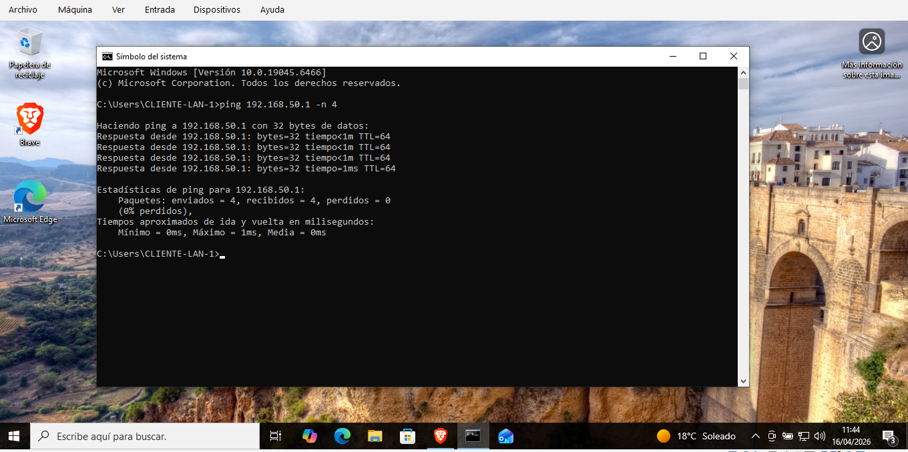

### 6.3: Validación de Salto a Gateway DMZ
Se realiza una prueba de alcance hacia la interfaz de la DMZ (**10.0.0.1**). El éxito de esta respuesta indica que el enrutamiento interno entre segmentos está activo y el kernel de pfSense procesa correctamente las peticiones ICMP.
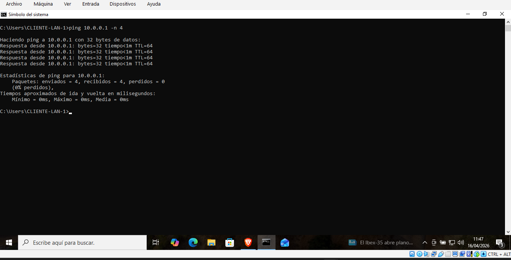

### 6.4: Acceso a la Interfaz Gráfica (WebGUI)
Finalmente, se valida el acceso al panel de administración mediante el navegador del cliente. La carga del Dashboard confirma que los servicios de servidor web y seguridad de pfSense están listos para la configuración avanzada. (usuario admin y contraseña pfsense)
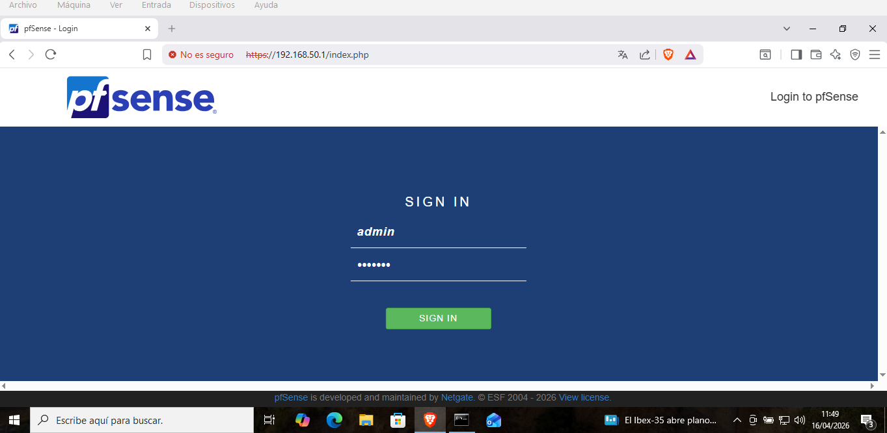

### 6.5: Dashboard de Estado del Sistema
Una vez autenticados, se accede al panel principal (Dashboard). En esta vista se verifica el estado de los servicios, el uso de recursos de hardware y que las tres interfaces (**WAN, LAN y DMZ**) se encuentran en estado "Up" con sus respectivas direcciones IP asignadas.
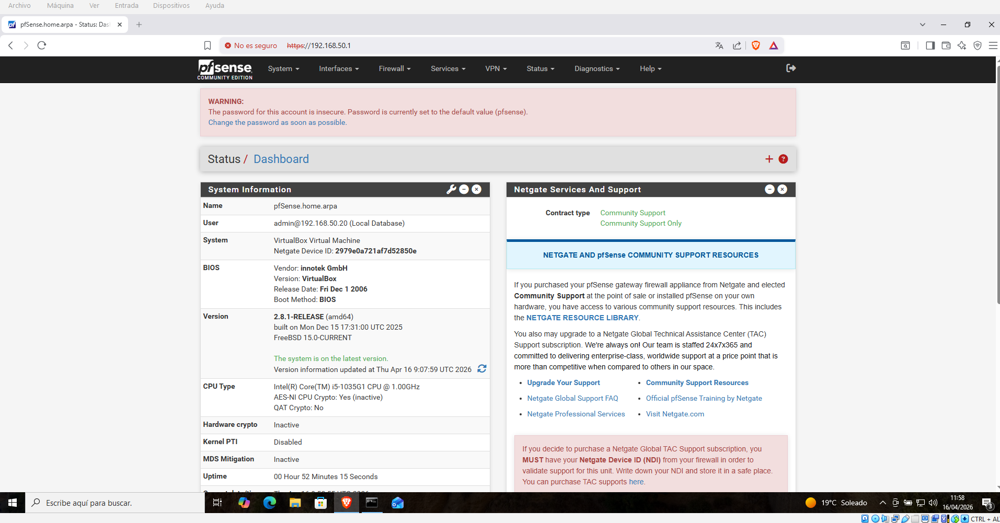

---

---

## 📂 Fase 07: Configuración Inicial del Sistema (General Setup)
En esta etapa se realizan los ajustes de identidad y red troncal del firewall, cumpliendo con los requisitos de personalización y conectividad externa mediante DNS.

### 7.1: Acceso al Menú de Configuración General
Para iniciar la personalización, navegamos a través del menú superior hacia **System > General Setup**. Este apartado permite modificar los parámetros de red globales que afectan al comportamiento de resolución y nombre del nodo.

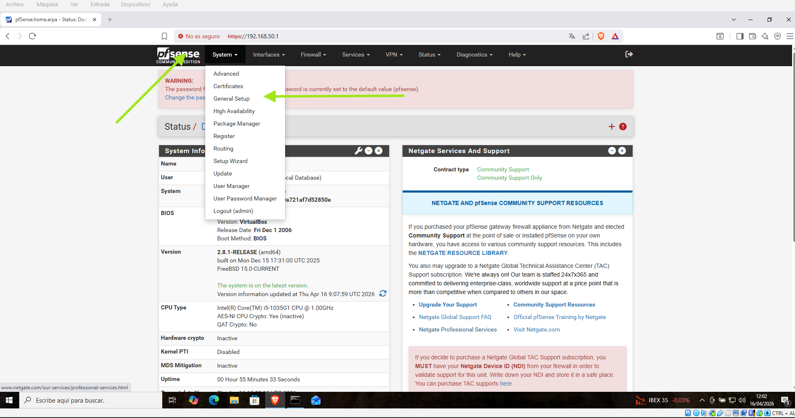

### 7.2: Configuración de Hostname y Servidores DNS
Siguiendo las directrices del enunciado, se personaliza la identidad del sistema y se asegura la resolución de nombres externa. Los parámetros configurados son:

* **Hostname:** Se establece el nombre del host con el formato de apellidos (ej. `PerezPepito`), facilitando la identificación del administrador.
* **DNS Server Settings:** Se configuran las IPs de Google (**8.8.8.8** y **8.8.4.4**) como servidores de confianza.
* **DNS Server Override:** Se desactiva la casilla para evitar que el proveedor de servicios (WAN/DHCP) sobrescriba los servidores configurados manualmente.

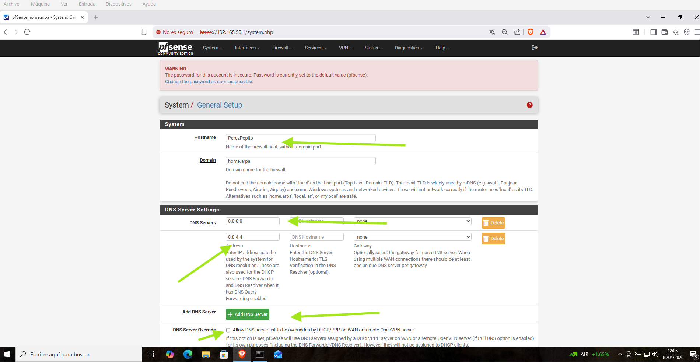

---

## 📂 Fase 08: Configuración Avanzada de Interfaces
En esta sección se ajustan los parámetros de seguridad específicos para cada segmento de red, comenzando por el endurecimiento de la interfaz WAN frente a tráfico no autorizado.

### 8.1: Acceso a la Configuración WAN
Para gestionar las reglas de seguridad de la entrada a internet, navegamos a través del menú **Interfaces > WAN**. Este apartado permite definir cómo el firewall interactúa con el tráfico proveniente del exterior.

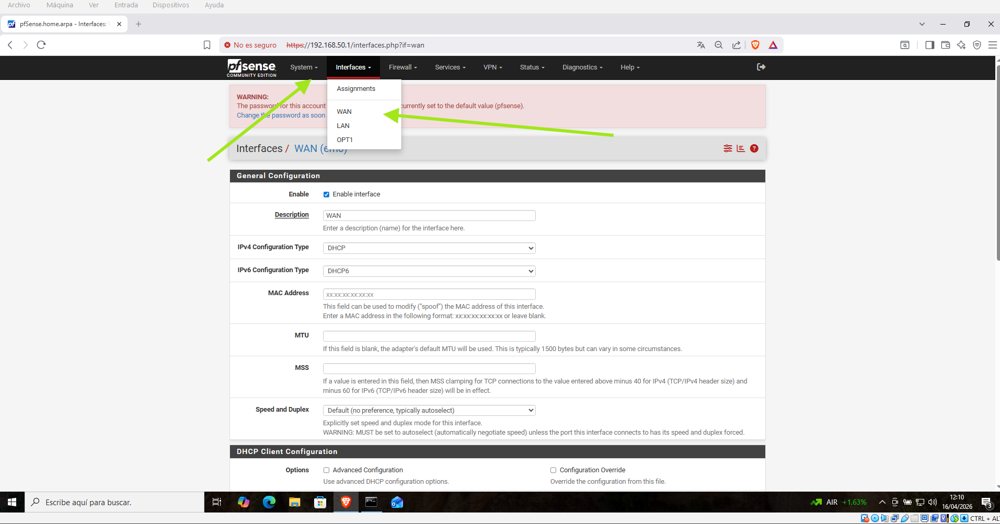

### 8.2: Protección Perimetral (RFC 1918 y Bogon Networks)
Haciendo scroll hasta el final de la página, en la sección **Reserved Networks**, se localizan las directivas de seguridad para el filtrado de redes no autorizadas. Se procede a marcar ambas opciones:

* **Block private networks and loopback addresses:** Bloquea el tráfico de redes privadas (RFC 1918) y direcciones de bucle local (127/8). Esta es la opción solicitada en el enunciado para evitar el ingreso de tráfico desde rangos no enrutables.
* **Block bogon networks:** Bloquea redes que aún no han sido asignadas oficialmente por la IANA o que están reservadas.

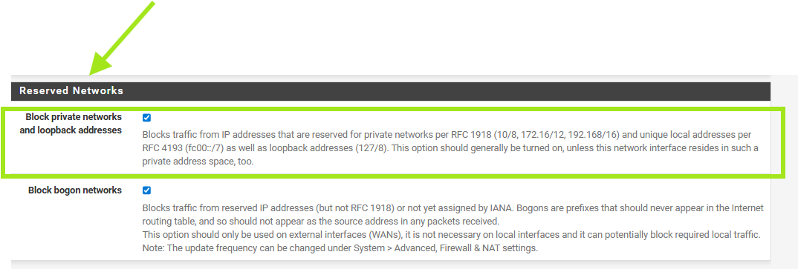

---

## 📂 Fase 09: Bloqueo de Clientes y Reglas de Filtrado
En esta fase se gestiona el control de acceso de los dispositivos en la red LAN. El objetivo es identificar un cliente específico y asegurar su identidad mediante un mapeo estático para aplicar posteriormente reglas de filtrado personalizadas.

### 9.1: Identificación de los Parámetros del Cliente
Antes de realizar el mapeo en pfSense, es necesario obtener los datos técnicos del host en la zona LAN. Mediante el comando `ipconfig /all` en el cliente, extraemos la dirección física (MAC) y la IP asignada que servirá de base para la reserva estática.

* **Hostname:** Oprekin-PC
* **Dirección Física (MAC):** 08-00-27-72-65-E7
* **IPv4 Address:** 192.168.50.10

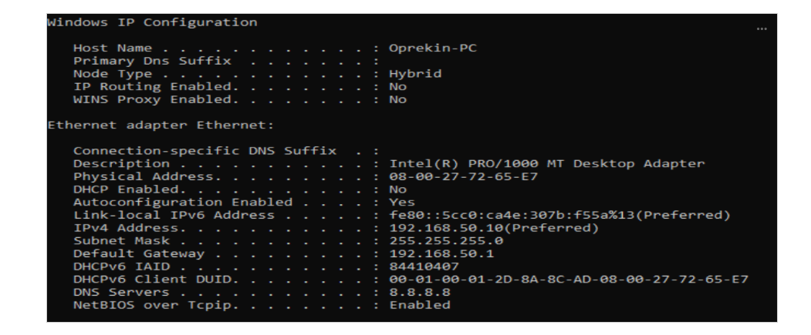

### 9.2: Acceso al Servidor DHCP
Para iniciar el proceso de reserva, navegamos en la WebGUI hacia **Services > DHCP Server**. Dentro de este menú, seleccionamos la pestaña **LAN**, que es el segmento donde reside nuestro cliente.

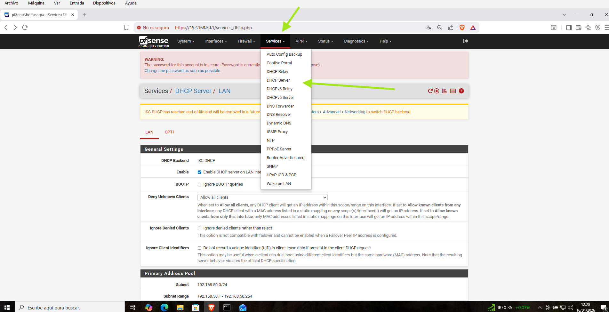

### 9.3: Localización del Mapeo Estático
Es imperativo realizar **scroll hasta la parte inferior** de la página de configuración DHCP. Al final del todo, localizamos la sección **DHCP Static Mappings for this Interface** y pulsamos el botón **+ Add** para abrir el formulario de reserva.

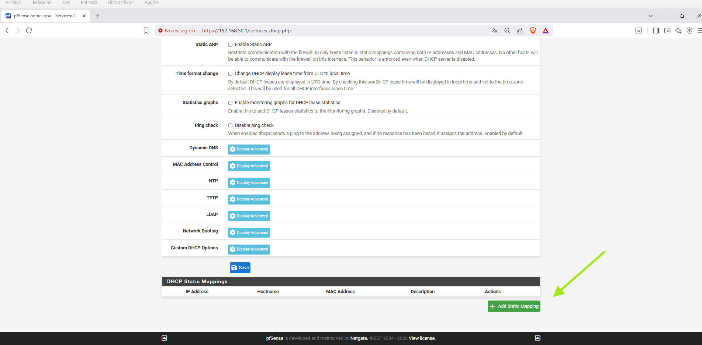

### 9.4: Registro del Mapeo Estático e Identificación
En el formulario **Static DHCP Mapping**, vinculamos de forma persistente los parámetros del cliente. Siguiendo el enunciado, se completan los campos técnicos y de auditoría:

* **MAC Address:** `08:00:27:72:65:e7`
* **IP Address:** `192.168.50.10`
* **Gateway:** `192.168.50.1`

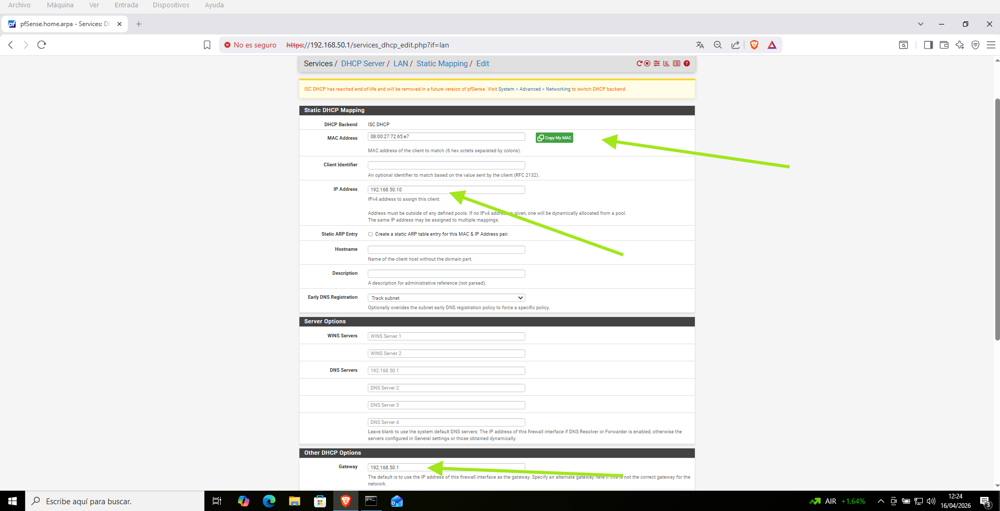

### 9.5: Identificación Personalizada del Administrador
Para finalizar el registro, se utiliza el campo **Description** insertando el identificador obligatorio con el formato `[Apellido1][Apellido2][Nombre]`. Este paso es clave para la trazabilidad de las reglas de red en entornos corporativos o de laboratorio.

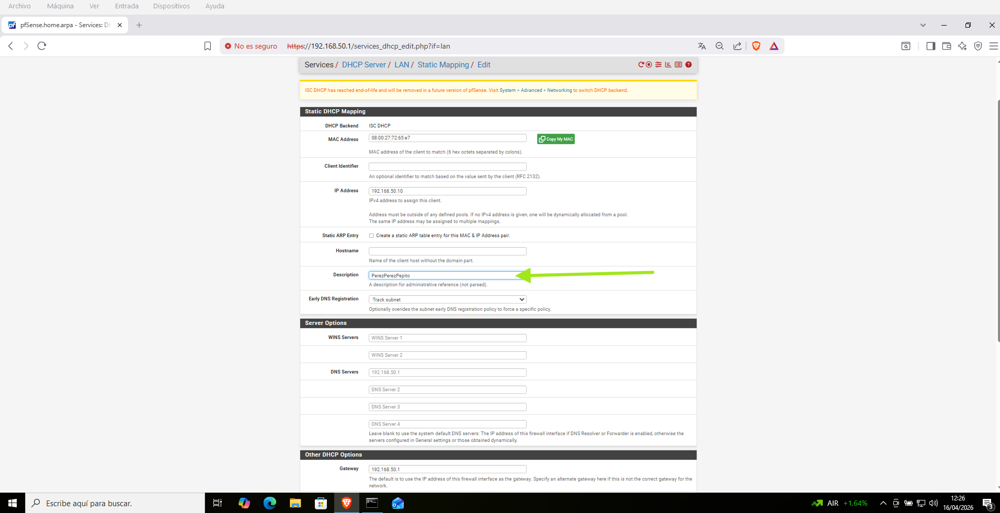

### 9.6: Guardado del Mapeo Estático
Una vez completados todos los campos del formulario, es fundamental pulsar el botón **Save** situado en la parte inferior. Este paso almacena la configuración en el sistema, pero requiere una confirmación adicional para activarse.

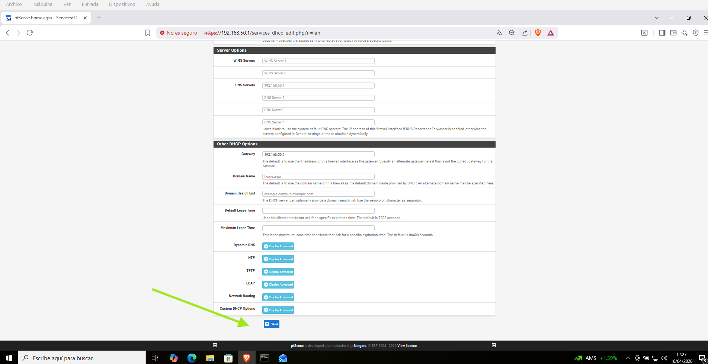

### 9.7: Aplicación Final de Cambios
Tras guardar, el sistema muestra un aviso indicando que la configuración de DHCP ha cambiado. Se debe pulsar el botón **Apply Changes** en el banner superior para que pfSense reinicie el servicio DHCP con la nueva reserva estática operativa. Una vez realizado, el cliente recibirá siempre la IP configurada.

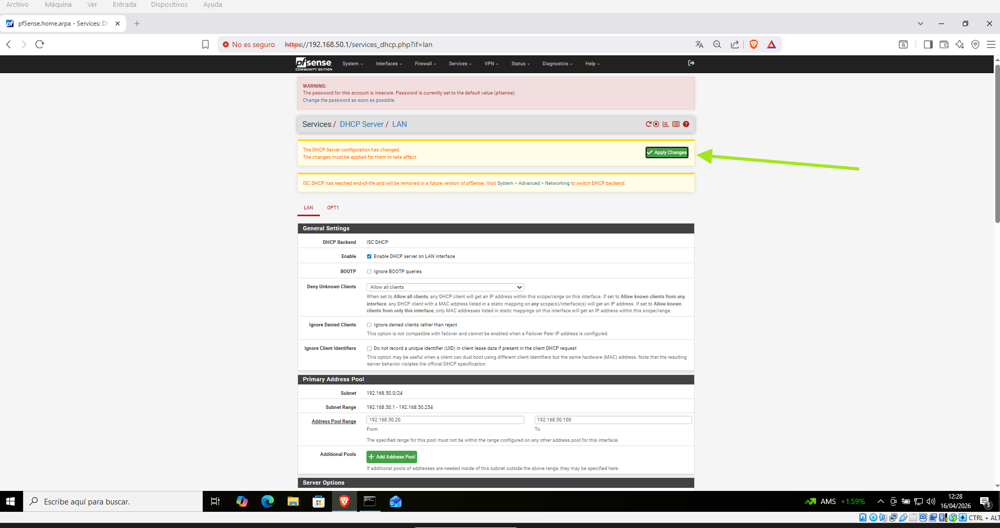

---

## 📂 Fase 10: Reglas de Filtrado y Comunicación entre Zonas
En esta fase se implementan las políticas de seguridad en el firewall para permitir el tráfico legítimo entre la zona LAN y la zona DMZ, aplicando el principio de mínimo privilegio y asegurando la administración remota de los activos críticos.

### 10.1: Acceso al Menú de Reglas de Firewall
Para establecer la comunicación entre segmentos, navegamos en la WebGUI de pfSense hacia el menú **Firewall > Rules**. Este apartado es el núcleo donde se definen las listas de control de acceso (ACL) del sistema.

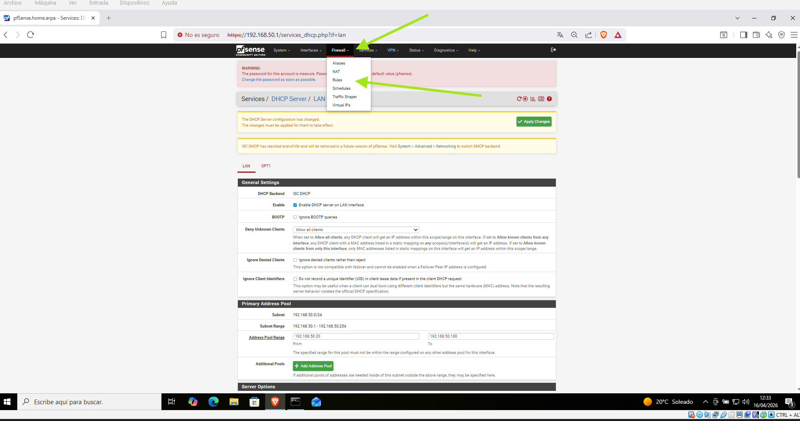

### 10.2: Selección de Interfaz LAN y Creación
Accedemos específicamente a la pestaña **LAN**. Siguiendo la lógica de pfSense, las reglas se aplican en la interfaz de entrada donde se origina el paquete. Pulsamos el botón **Add (flecha arriba)** para insertar la regla al principio de la lista, garantizando que se evalúe antes que las reglas de denegación por defecto.

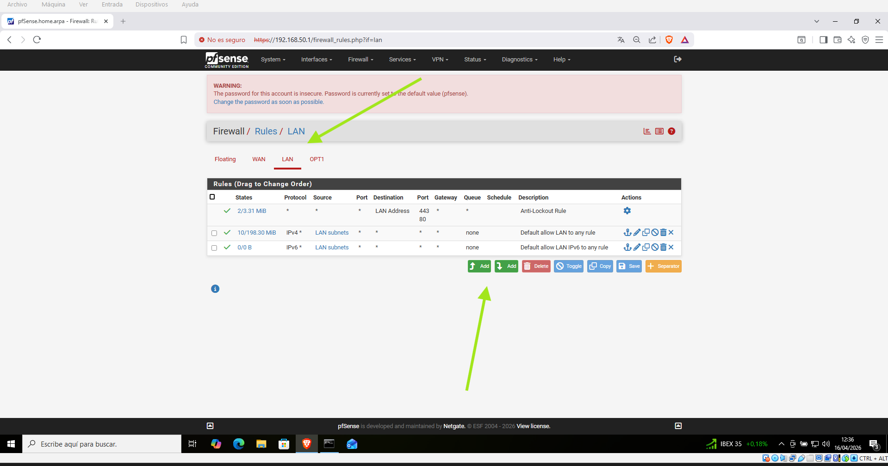

### 10.3: Configuración de la Regla SSH (LAN a DMZ)
Se completa el formulario de edición con los parámetros técnicos que garantizan el acceso del cliente administrativo al servidor de la zona desmilitarizada, filtrando por protocolo y puerto específico:

* **Action:** Pass (Permitir el tráfico).
* **Interface:** LAN.
* **Protocol:** TCP.
* **Source:** Address or Alias -> `192.168.50.10` (Cliente identificado).
* **Destination:** Address or Alias -> `10.0.0.50` (Servidor Ubuntu DMZ).
* **Destination Port Range:** SSH (22).

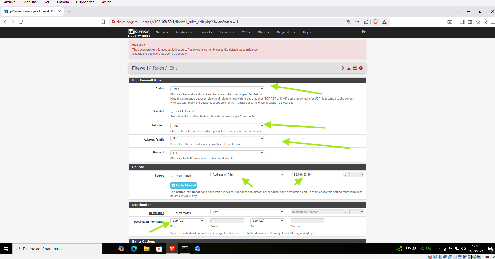

### 10.4: Almacenamiento de la Directiva
Tras verificar la exactitud de los datos introducidos, procedemos a pulsar el botón **Save** al final del formulario. Este paso guarda la configuración en la base de datos, quedando pendiente de la activación definitiva por parte del motor de filtrado.

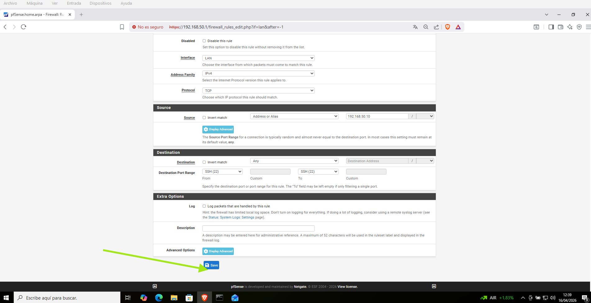

### 10.5: Aplicación Final y Verificación del Listado
Como cierre del proceso, pulsamos el botón **Apply Changes**. La regla aparece ahora activa en el listado de la interfaz LAN, confirmando que el flujo de datos desde el host `192.168.50.10` hacia el servidor en la DMZ por el puerto 22 será permitido por el firewall.

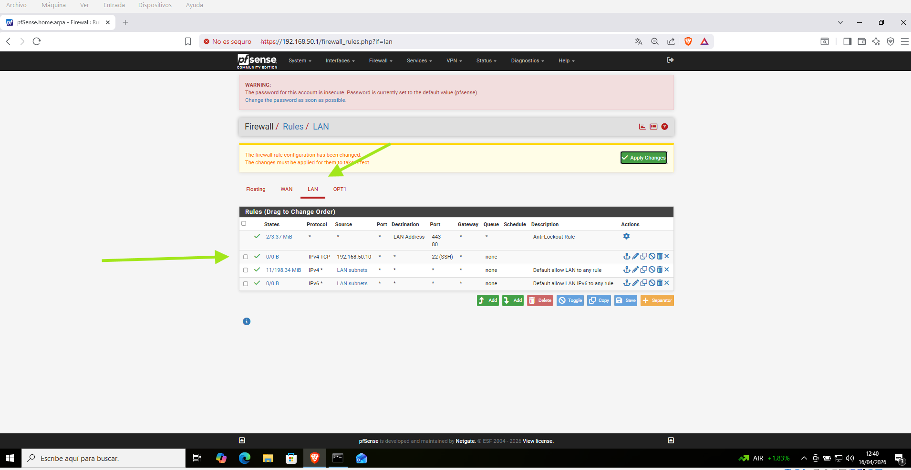

---

## 🏆 Conclusión Final

El laboratorio de seguridad perimetral se ha completado con éxito. Hemos transformado una instalación base de **pfSense** en un **Firewall de Próxima Generación (NGFW)** funcional, con segmentación de red profesional (LAN/DMZ), gestión estática de clientes y políticas de filtrado por capas.

## 🛠️ Especificaciones Técnicas

Para asegurar la replicabilidad de este entorno de seguridad, se detallan los recursos utilizados:
* **Firewall:** ** pfSense Community Edition (v2.8.1+)
* **Hipervisor:** Oracle VirtualBox 7.x.
* **Arquitectura de Red:** * **WAN:** Modo Puente (Acceso a Internet).
    * **LAN:** Red Interna (`192.168.50.0/24`).
    * **DMZ:** Red Interna (`10.0.0.0/24`).
* **Recursos VM:** 1GB RAM | 1 vCPU | 8GB Disco VDI.

## 🧠 Lecciones Aprendidas (Troubleshooting)

Durante el despliegue se identificaron puntos críticos que garantizan el éxito de la infraestructura:
* **Persistencia de Identidad:** Se validó que sin un **Mapeo Estático DHCP**, las reglas de firewall basadas en IP pierden su validez ante cualquier renovación de concesión o reinicio del cliente.
* **Lógica de Filtrado:** Es imperativo configurar las reglas en la **interfaz de origen** (LAN), ya que pfSense procesa los paquetes en su punto de entrada al firewall.
* **Jerarquía de Reglas:** Se comprendió la importancia del orden en el listado; las reglas específicas deben preceder siempre a los bloqueos genéricos para evitar el descarte de tráfico legítimo.

## 🚀 Hoja de Ruta (Próximos Pasos)

Este proyecto es la base para futuras implementaciones de seguridad avanzada:

* ☐ **Fase 11:** Configuración de VPN (OpenVPN/IPsec) para acceso remoto seguro.
* ☐ **Fase 12:** Implementación de IDS/IPS (Snort o Suricata) para detección de intrusiones.
* ☐ **Fase 13:** Configuración de Servidor Proxy y filtrado de contenidos con Squid/SquidGuard.
